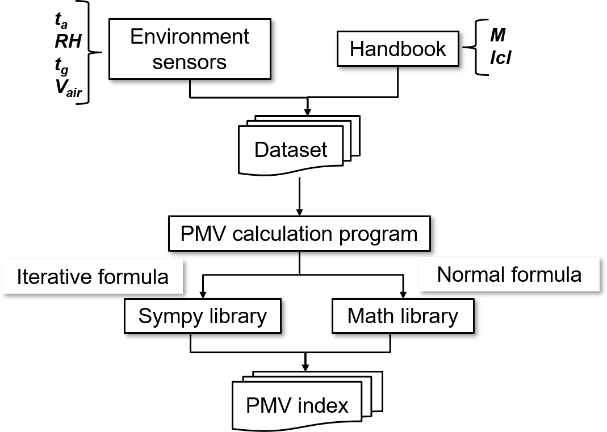

# Introduction
PMV calculation is very complex due to it itneary and time consuming. In this part, we proposed one method could calculate it in real-time.

# PMV Calculation Algorithm

This repository contains an implementation of the Predicted Mean Vote (PMV) calculation algorithm. PMV is a thermal comfort index that predicts the mean value of the votes of a large group of people on the 7-point thermal sensation scale, which ranges from cold (-3) to hot (+3).
<p align="center">
  
</p>

## Algorithm Flowchart

### 1. Initialize Environment Monitor Class
- **Step 1:** Create a class named `EnvironmentMonitor`.
- **Step 2:** In the class's `__init__` method, set the metabolism rate `M` and calculate the clothing insulation `clo` by calling the `calculate_clothing_insulation()` method.
- **Step 3:** Calculate the `fM` value using the formula `0.303 * np.exp(-0.036 * self.M) + 0.028`.

### 2. Calculate Clothing Insulation
- **Step 4:** Define the `calculate_clothing_insulation()` method, which returns the appropriate `clo` value based on the current month.
  - **Summer (June-August):** Return `0.5`
  - **Intermediate seasons (March-May and September-November):** Return `0.6`
  - **Winter (December-February):** Return `0.8`

### 3. Get Indoor Environment Data
- **Step 5:** Define the `get_indoor_environment_data()` method to fetch and return the following environmental data:
  - Indoor temperature `Ta`
  - Globe temperature `Tg`
  - Relative humidity `humidity`
  - CO2 concentration `CO2_conce`
  - Atmospheric pressure `pressure`
  - Mean Radiant Temperature `Tm` (calculated using a specific formula)

### 4. Calculate PMV
- **Step 6:** Define the `calculate_pmv(Ta, Tm, wind_speed, humidity)` method.
  - **Step 6.1:** Calculate `KPa` using the formula `6.11 * 10 ** (7.5 * Ta / (Ta + 237.3)) / 10 * humidity / 100`.
  - **Step 6.2:** Calculate `E` using the formula `3.05 * (5.73 - 0.007 * M - KPa) + 0.42 * (M - 58.15)`.
  - **Step 6.3:** Based on the wind speed `W`, choose the appropriate calculation method:
    - **Low wind speed (W < 0.2):**
      - Define symbols `C` and `R`.
      - Calculate `E1` and `C1`.
      - Set up the system of equations and solve.
    - **High wind speed (W >= 0.2):**
      - Define symbols `C` and `R`.
      - Set up the system of equations and solve.
  - **Step 6.4:** Select the appropriate `C` and `R` values from the results.
  - **Step 6.5:** Calculate `S` using the formula `M - (C + R + E) - (C1 + E1)`.
  - **Step 6.6:** Calculate the PMV value using the formula `fM * S` and format the result to two decimal places.

### 5. Example Usage
- **Step 7:** Create an instance of the `EnvironmentMonitor` class.
- **Step 8:** Call the `get_indoor_environment_data()` method to fetch environmental data.
- **Step 9:** Call the `calculate_pmv(Ta, Tm, wind_speed, humidity)` method to calculate the PMV value.
- **Step 10:** Print the calculated PMV value.

## Code Example

```python
import datetime
import math
import numpy as np
import sympy as sy

class EnvironmentMonitor:
    def __init__(self):
        self.M = 64.0  # Metabolism rate
        self.clo = self.calculate_clothing_insulation()  # Clothing insulation
        self.fM = 0.303 * np.exp(-0.036 * self.M) + 0.028

    def calculate_clothing_insulation(self):
        month = datetime.datetime.now().month
        if 6 <= month <= 8:
            return 0.5  # Summer
        elif 9 <= month <= 11 or 3 <= month <= 5:
            return 0.6  # Intermediate seasons
        else:
            return 0.8  # Winter

    def get_indoor_environment_data(self):
        Ta = 25.0  # Indoor temperature
        Tg = 25.0  # Globe temperature
        Tm = ((float(Tg) + 273) ** 4 + 0.4 * 10 ** 8 * abs(float(Tg) - float(Ta)) ** (1 / 4) * (float(Tg) - float(Ta))) ** (
                1 / 4) - 273
        Tm = "{:.0f}".format(Tm)
        humidity = 50.0  # Relative humidity
        CO2_conce = 400  # CO2 concentration
        pressure = 1013.25  # Atmospheric pressure

        return float(Ta), float(humidity), float(CO2_conce), float(pressure), float(Tm), float(Tg)

    def calculate_pmv(self, Ta, Tm, wind_speed, humidity):
        W = float(wind_speed)
        KPa = (6.11 * 10 ** (7.5 * float(Ta) / (float(Ta) + 237.3))) / 10 * float(humidity) / 100
        E = 3.05 * (5.73 - 0.007 * float(self.M) - float(KPa)) + 0.42 * (float(self.M) - 58.15)

        if W < 0.2:
            C, R = sy.symbols("C R")
            E1 = 0.0173 * (5.87 - float(KPa))
            C1 = 0.0014 * self.M * (34 - float(Ta))
            eq = [92.6377226 - 0.25425448 * R - 2.7294559 * float(Ta) - C,
                  3.96 * 10 ** (-8) * (1 + 0.3 * self.clo) * ((((35.7 - 0.0275 * 64) - 0.155 * self.clo * (C + R)) + 273) ** 4
                                                         - (float(Tm) + 273) ** 4) - R]
        else:
            C, R = sy.symbols("C R")
            eq = [332.40836 * W ** 0.6 - 0.910842 * W ** 0.6 * (C + R) - 9.794 * W ** 0.6 * float(Ta) - C,
                  3.96 * 10 ** (-8) * (1 + 0.3 * self.clo) * (
                          (((35.7 - 0.0275 * float(self.M)) - 0.155 * float(self.clo) * (C + R)) + 273) ** 4
                          - (float(Tm) + 273) ** 4) - R]

        result = sy.nonlinsolve(eq, [C, R])
        result_list = list(result)
        result_list = [item for item in result_list if complex(item[0]).imag == 0 and complex(item[1]).imag == 0]

        for i in result_list:
            C = i[0]
            if 0 < C < 50:
                C = C
            R = i[1]
            if 0 < R < 50:
                R = R

        S = float(self.M) - (C + R + E) - (C1 + E1)
        PMV = float(self.fM) * S
        PMV = '{:.2f}'.format(PMV)
        return PMV

# Example usage:
monitor = EnvironmentMonitor()
Ta, humidity, CO2_conce, pressure, Tm, Tg = monitor.get_indoor_environment_data()
pmv = monitor.calculate_pmv(Ta, Tm, 0.1, humidity)  # Example wind speed
print("Calculated PMV:", pmv)


